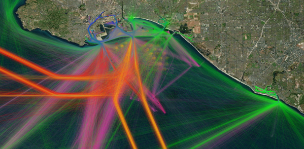
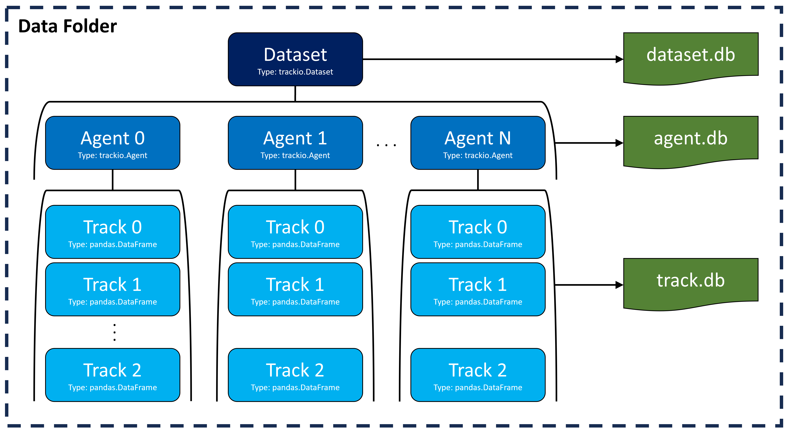
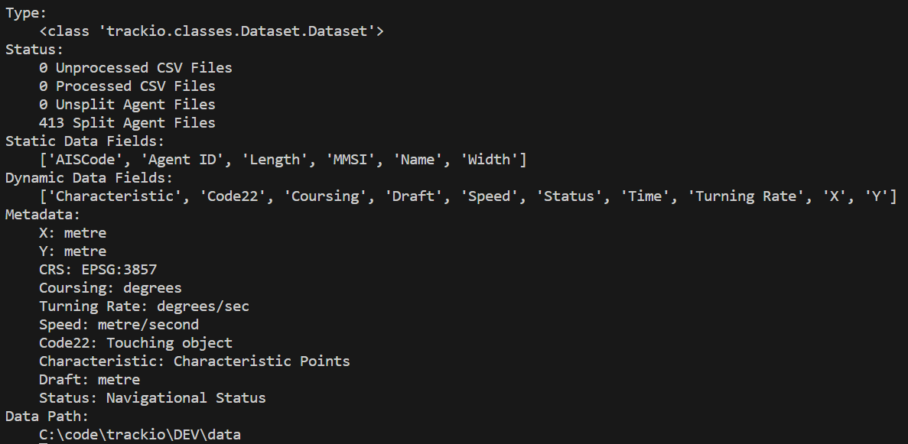
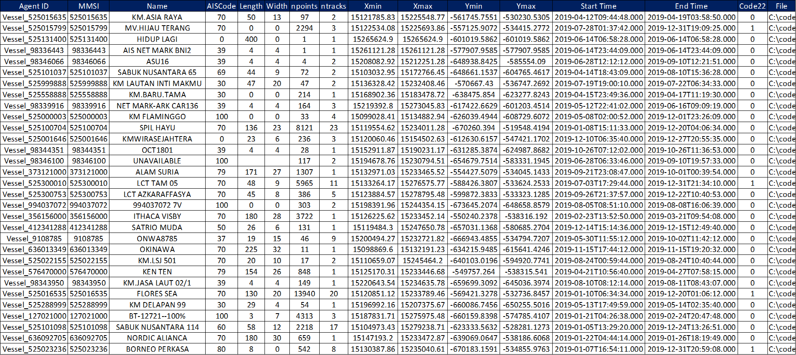
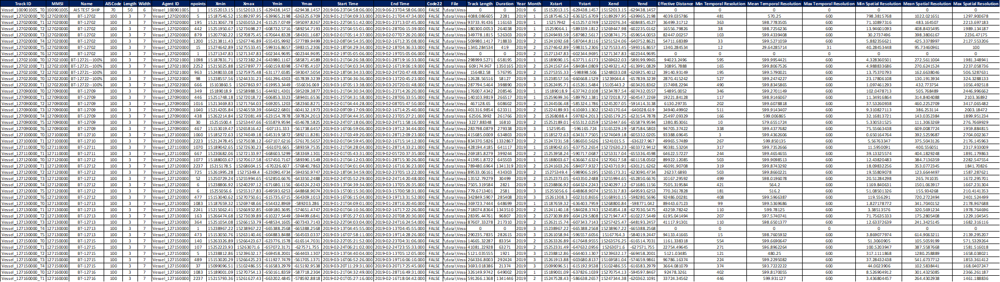
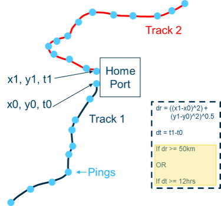
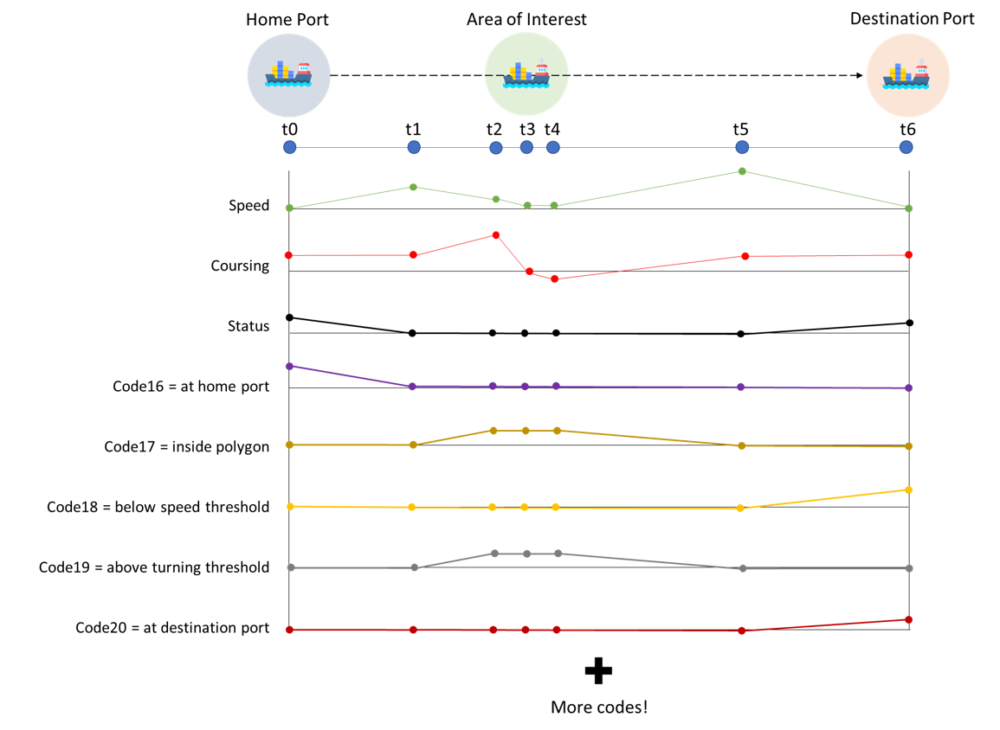

# *trackio* - A Python approach to working with spatiotemporal mass movement data

This is an open source library geared towards working with different kinds of mass movement or trajectory data.

Examples include data from vessels, planes, cars, animal migrations, Agent Based Modelling output, hurricane paths, etc. Anything that contains movements stored in spatiotemporal (X, Y, Time) point format. 

Below is an example of such data from an AIS vessel dataset:

This library contains functionality to help ingest, clean/repair, perform I/O conversions, process, and visualize mass movement data. The library is able to natively ingest data in formats such as:

* CSV and other ASCII files
* Feather files
* Pandas DataFrames
* GeoPandas GeoDataFrames

And is extendable to any new dataset that hasn't been seen by the library before.

Unlike other similar libraries, `trackio` was designed for arbitrary sized datasets with arbitrary computational resources. I.e., if you have a huge amount of data spread across hundreds of files with different column names, and a modest machine with CPU/RAM limitations, this library will still work!

`trackio` also has heavy operations coded in parallel to leverage powerful machines for faster analyses on large datasets. As well, `trackio` is interoperable with Dask bags, so the sky is the limit in terms of custom functionality and processing.

## Table of Contents

<!--ts-->
   * [Installation](#installation)
   * [Overall Structure](#overall-structure)
   * [Functionality](#functionality)
   * [Examples](#examples)
<!--te-->

## Installation

This library works on Windows (including WSL2) and Linux.

This library was written using Python 3.10, it is recommended to use this version. It has not been tested on other versions.

This library requires `gdal` >= 3.5.1 and `Cython` libraries, thus creating an environment is recommended.

If using Anaconda/Miniconda, run this from the `trackio` folder **in this order**:

`conda create -n trackio python=3.10`

`conda activate trackio`

`conda install -c conda-forge gdal`

`conda install -c conda-forge rasterio`

`conda install -c conda-forge geopandas`

`pip install ./trackio/supporting/inpoly-python-0.2.0.zip` (might need to download Visual Studio C++ Dev Tools for Windows; the link will be in the error, just follow the instructions to install)

`pip install .` 

## Overall Structure

The `trackio` library is structured in a way where the `Dataset` is the main class object. The `Dataset` object is a custom class object that contains references to stored data, as well as a series of attributes and methods that make it easy to operate on the data. 

The `Agent` class is a custom class object that represents a single agent in the `Dataset`. This contains all the data pertaining to one vessel, one animal, one car, etc. All of the spatiotemporal track data is stored in individual `Agent` class objects. Each `Agent` class object is stored in its own binary file once the raw data is split up. 

The actual tracks associated with any given vessel are simply stored as pandas DataFrames in the `Agent.tracks` attribute. The `Agent.tracks` property is a dictionary containing *Track ID, Track DataFrame* key, value pairs.

The `Dataset` keeps all of the data in a user-specified folder, along with `dataset.db`, `agent.db`, and `track.db` files. The various `.db` files contain metadata about the overall dataset, agents, and tracks contained in the `Dataset`.

This is illustrated in the below figure:

The `dataset.db` file contains metadata about the actual `Dataset` in its entirety:

The `agent.db` file contains a GeoPandas GeoDataFrame of metadata about all of the agents in the `Dataset`. The geometry column of the GeoDataFrame contains bounding boxes for each agent:

Similarly, the `track.db` file contains the same information, but for each track in the `Dataset`:

These are essentially used as tables with metadata about the track data, which you to filter/query/operate on the track data much faster.

## Functionality

The below provides a bullet list of the various functionality that is included in this library, for more information and detailed examples, please refer to [Examples](#examples):

Data Ingestion
* From CSV and other pandas friendly ASCII files
* From Feather format
* From pandas DataFrame containing points
* From GeoPandas GeoDataFrame containing LineStrings of trajectories

Data Clipping
* Clipping raw data to polygon or bounding box prior to ingestion

Column and Data Field Mapping
* Scanning and mapping raw data columns to standard names
* Extension of standard name mapper to handle any new format of data automatically
* Scanning of unique data fields across all files in dataset
* Mapping of data fields to custom values during data ingestion (e.g. converting text descriptions to integer codes)
* Generation of new static/dynamic fields by mapping existing data fields (e.g. adding a L/M/H speed description based on object speed)

Splitting Points into Tracks
* Spatiotemporal threshold based splitting
* Modified spatiotemporal threshold splitting to handle duplicated agent identifier (e.g. MMSI for AIS vessels)
* K-Means based clustering and splitting of points into tracks
* DBSCAN based clustering and splitting of points into tracks
* Splitting of tracks into sub-tracks based on data fields (e.g. splitting a track into sub-tracks where splits occur at major stops)
* Reconnecting "bad" splits caused by erroneous data

Processing
* Reprojection to different CRS
* Spatial/temporal resampling
* Interpolation to dataset-wide global time axis
* Computation of track coursing
* Computation of track turning rate
* Computation of track speed
* Computation of track acceleration
* Smoothing of sharp corners
* Decimation/simplification of tracks
* Simplification of track stops
* Imprinting geometry into tracks
* Interpolating raster data onto tracks
* Routing tracks through "cost rasters"

Analysis
* Extraction of characteristic tracks
* Computation of encounters between tracks
* Computation of track intersections
* Computation of closest encounter distance to object(s)
* Computation of closest encounters between tracks
* Computation distance proximity distributions between tracks
* Extraction of lateral position distributions along tracks
* Extraction of arbitrary data distributions along tracks
* Time spent inside polygon(s)
* Generation of unstructured graphs (flow maps) from track data

Classification

Another unique aspect of `trackio` is the ability to "classify" points along a track. This means to assess some `True` or `False` condition at each point along a track. This could represent if an agent in inside a polygon, above a given speed threshold, stopped, turning, etc. 

This is illustrated in the below image:

When leveraged, this information can be extremely valuable for performing multi-layered filtering and conditional operations. For example, one could use this information to find vessel tracks that turned inside of a specific polygon that wasn't the home or destination port.

As track data is classified, the metadata tables are updated. This way you can use these classifications as part of filters later on to select or process the data further.

Input / Output
* Pandas DataFrame
* GeoPandas GeoDataFrame, 1 feature for each track
* GeoPandas GeoDataFrame, 1 feature for each segment
* Dask bag for custom processing
* Rasterized track counts
* Rasterized track attributes (e.g. time spent in pixel)
* Representative unstructured graph

## Examples

There are a series of Jupyter notebooks available in the `notebooks` folder.

The example notebooks showcase the full range of functionality for the library.