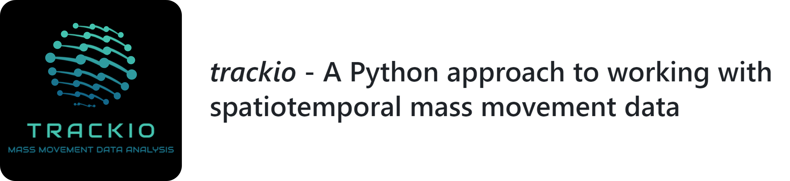

---

<!--ts-->
   * [Overview](#overview)
   * [Installation](#installation)
   * [Data Structures](#data-structures)
   * [Functionality](#functionality)
   * [Documentation & Examples](#documentation)
<!--te-->

## Overview

This is an open source library geared towards working with mass movement or track data.

The library contains functionality to ingest, clean/repair, perform I/O conversions, process, analyze, and visualize mass movement data. In addition, it provides a robust feature engineering framework for downstream AI/ML applications.

Examples include data from vessels (AIS), planes (ADS), cars, animal migrations, Agent Based Modelling (ABM) output, hurricane paths, particles, etc. 
Anything that contains movements stored in spatiotemporal (X, Y, Time) point format. 3D data is also supported, with Z stored as a dynamic data field.

Below is an example of such data from an AIS vessel dataset:

The library is able to natively ingest data in formats such as:

* CSV and other ASCII files
* Feather files
* Pandas DataFrames
* GeoPandas GeoDataFrames

It can be extended to any data format as long as you can get it into a valid native format with upstream custom code.

Unlike other similar libraries, `trackio` was designed for memory-safe processing of arbitrarily sized, heterogenous datasets on a modest machine.
I.e., if you have a huge amount of data spread across hundreds of files with potentially different column names in every file, and a modest machine 
with CPU/RAM limitations, this library will still work!

`trackio` also has heavy operations coded in parallel to harness available computational power for faster analyses on large datasets. 

As well, `trackio` is interoperable with Dask bags, so the sky is the limit in terms of custom functionality and processing, or integrating with other tools.

`trackio` is largely based on Numpy, Pandas, GeoPandas, Dask, scikitlearn, GDAL, and Python's pickle module.

## Installation

This library works on Windows (including WSL2) and Linux.

This library was written using Python 3.10, it is recommended to use this version. It has not been tested on other versions.

This library uses specific `GDAL` and `rasterio` wheels, so it's recommended to create a fresh environment.

If using Anaconda/Miniconda, run this from the `trackio` folder:

`conda create -n trackio python=3.10`

`conda activate trackio`

`pip install .` 

**Please note for the `inpoly` library, it requires Visual Studio C++ Dev Tools for Windows. If you don't have it already,**
**the link will be in the error message, just follow the instructions to download then redo the trackio installation.**

## Data Structures

The `trackio` library is structured so `Dataset` is the main class that you interface with. The `Dataset` class is a custom class that contains references to stored data, metadata about this data, and a series of attributes and methods that make it easy to operate on the data. 

When you make a `Dataset`, all of the data will be stored in the `Dataset.data_path` folder. In this folder, is a series of files, each one containing data pertaining to one unique agent in the dataset. Each of these files contains an `Agent`
class object.

The `Agent` class is a custom class that represents a unique agent in the `Dataset`. It holds the metadata and dynamic data pertaining to one vessel, one animal, one car, etc. 

The actual tracks associated with any given vessel are simply stored as pandas DataFrames in the `Agent.tracks` attribute. The `Agent.tracks` property is a dictionary containing *Track ID, Track DataFrame* key, value pairs.

In the `Dataset.data_path` folder, you will also find `dataset.db`, `agent.db`, and `track.db` files. The various `.db` files contain metadata at the dataset, agent, and track levels.

This is illustrated in the below figure:

The `dataset.db` file contains metadata about the actual `Dataset` in its entirety:

The `agent.db` file contains a GeoPandas GeoDataFrame of metadata about all of the agents in the `Dataset`. The geometry column contains bounding boxes for each agents' data:

The `track.db` file contains similar information, but for each track in the `Dataset`:

Every agent and track is tagged with a unique identifier for record-keeping purposes and consistency
throughout analyses.

These tables are used as a very lightweight, poor-man's version of SQL lookup tables.

## Functionality

The below provides a bullet list of the various functionality that is included in this library, for more information and detailed examples, please refer to [Documentation & Examples](#documentation):

### [Data Ingestion](https://github.com/derekeden/trackio/blob/main/notebooks/03%20-%20Creating%20a%20Dataset%20from%20Raw%2C%20DataFrame%2C%20GeoDataFrame.ipynb)
* From CSV and other pandas friendly ASCII files
* From Feather format
* From pandas DataFrame containing points
* From GeoPandas GeoDataFrame containing LineStrings of trajectories

### [Data Clipping](https://github.com/derekeden/trackio/blob/main/notebooks/02%20-%20Pre-processing%20-%20Clipping%20data%20to%20box%20or%20polygon.ipynb)
* Clipping raw data to polygon or bounding box prior to ingestion

### Static / Dynamic Data Field Mapping ([here](https://github.com/derekeden/trackio/blob/main/notebooks/01%20-%20Pre-processing%20-%20Mapping%20columns%20and%20data.ipynb) and [here](https://github.com/derekeden/trackio/blob/main/notebooks/07%20-%20Data%20Mapping%2C%20Exploring%20Metadata%20Tables.ipynb))
* Scanning and mapping raw data columns to standard names
* Extension of standard name mapper to handle any new format of data automatically
* Scanning of unique data fields across all files in dataset
* Mapping of data fields to custom values during data ingestion (e.g. converting text descriptions to integer codes)
* Generation of new static/dynamic fields by mapping existing data fields (e.g. adding a L/M/H speed description based on object speed)

### Splitting Points into Tracks ([here](https://github.com/derekeden/trackio/blob/main/notebooks/04%20-%20Grouping%20Points%20and%20Splitting%20Tracks.ipynb) and [here](https://github.com/derekeden/trackio/blob/main/notebooks/06%20-%20More%20Splitting%2C%20Repairing%2C%20Cleaning%20Tracks.ipynb))
* Spatiotemporal threshold based splitting
* Modified spatiotemporal threshold splitting to handle duplicated agent identifier (e.g. MMSI for AIS vessels)
* K-Means based clustering and splitting of points into tracks
* DBSCAN based clustering and splitting of points into tracks
* Splitting of tracks into sub-tracks based on data fields (e.g. splitting a track into sub-tracks where splits occur at major stops)
* Reconnecting "bad" splits caused by erroneous data

### [Processing](https://github.com/derekeden/trackio/blob/main/notebooks/08%20-%20Geometric%20Operations.ipynb)
* Reprojection to different CRS
* Spatial/temporal resampling
* Interpolation to dataset-wide global time axis
* Smoothing of sharp corners
* Decimation/simplification of tracks
* Simplification of track stops
* Imprinting geometry into tracks
* Routing tracks through "cost rasters"

### [Feature Engineering](https://github.com/derekeden/trackio/blob/main/notebooks/09%20-%20Computing%20Derived%20Dynamic%20Data%20(Feature%20Engineering).ipynb)
* Computation of track coursing
* Computation of track turning rate
* Computation of track speed
* Computation of track acceleration
* Computation of track sinuosity
* Computation of track radius of curvature
* Interpolating raster data onto tracks
* Computation of track fractal dimension

### [Analysis](https://github.com/derekeden/trackio/blob/main/notebooks/11%20-%20Analysis.ipynb)
* Extraction of characteristic tracks
* Computation of encounters between tracks
* Computation of track intersections
* Computation of closest encounter distance to object(s)
* Computation of closest encounters between tracks
* Computation distance proximity distributions between tracks
* Extraction of lateral position distributions along tracks
* Extraction of arbitrary data distributions along tracks
* Time spent inside polygon(s)
* Generation of unstructured graphs (flow maps) from track data

### [Classification](https://github.com/derekeden/trackio/blob/main/notebooks/12%20-%20Classifying%20Tracks.ipynb)

Another unique aspect of `trackio` is the ability to "classify" points along a track. This means to assess some `True` or `False` condition at each point along a track. This could represent if an agent in inside a polygon, above a given speed threshold, stopped, turning, accelerating/deccelerating, within a certain distance of a target object, etc.

This is illustrated in the below image:

When leveraged, this information can be extremely valuable for performing multi-layered filtering and conditional operations. 

For example, one could use distance to known fishing grounds, a polygon, and track sinuosity/speed/turning thresholds, to
identify segments of tracks where fishing activity was occurring.

As track data is classified, the metadata tables are updated. This way you can use these classifications as part of filters later on to select or process the data further.

### [Input / Output](https://github.com/derekeden/trackio/blob/main/notebooks/13%20-%20Input%20Output.ipynb)
* Pandas DataFrame
* GeoPandas GeoDataFrame, 1 feature for each track
* GeoPandas GeoDataFrame, 1 feature for each segment
* Dask bag for custom processing
* Rasterized track counts
* Rasterized track attributes (e.g. time spent in pixel)
* Representative unstructured graph

## Documentation

There are a series of Jupyter notebooks available in the [notebooks](https://github.com/derekeden/trackio/tree/main/notebooks) folder.

The example notebooks showcase the full range of functionality for the library, as well as 3 specific
example case studies.

There are complete docstrings for public functions and classes. At this time, there are no docstrings
for private/utility functions that are not exposed to the user.
